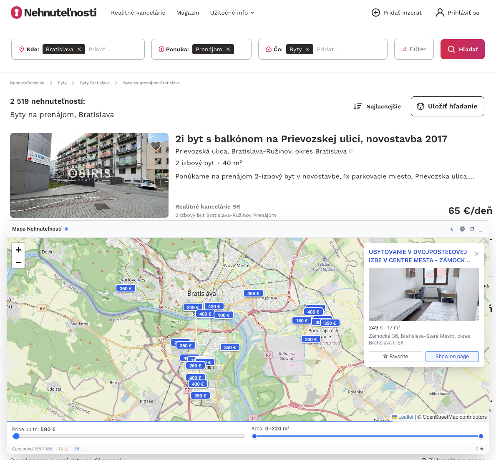

<div align="center">


# Mapa Nehnuteľností

Chrome rozšírenie, ktoré pridáva interaktívnu mapu inzerátov priamo do [nehnutelnosti.sk](https://www.nehnutelnosti.sk).

</div>



## Čo to robí

Pri prehliadaní výpisu inzerátov na nehnutelnosti.sk sa v rohu stránky objaví prekrytie s mapou. Adresy z inzerátov sa automaticky geokódujú cez OpenStreetMap Nominatim a zobrazia ako značky na mape. Klikom na značku sa zobrazí náhľad inzerátu a opačne — výber inzerátu z výpisu pan-uje mapu na jeho polohu.

## Funkcie

- **Mapa inzerátov** — všetky aktuálne načítané inzeráty z výpisu sú vykreslené na OpenStreetMap dlaždiciach
- **Tri režimy okna** — collapsed (plávajúce tlačidlo) → normal (480×360) → maximized (celá šírka × 50 % výšky)
- **Filtre**
  - Cena: do max. hodnoty (krok 10 €)
  - Plocha: rozsah od–do (m²)
- **Štítky markerov** — namiesto bodky vie marker zobraziť cenu, názov alebo plochu (rýchly toggle v hlavičke alebo cez Nastavenia)
- **Obľúbené** — uložené naprieč reštartmi
- **Lokálna cache** — geokódované súradnice sa cachujú v IndexedDB, takže sa pri opätovnej návšteve neopytujú znova
- **Slovenčina + angličtina**

## Inštalácia (vývoj)

Repozitár používa **pnpm** workspaces a **Turborepo**.

```bash
pnpm install
pnpm dev
```

Build:

```bash
pnpm build
```

Načítanie do Chrome:

1. Otvoriť `chrome://extensions`
2. Zapnúť **Developer mode**
3. **Load unpacked** → vybrať priečinok `dist/`
4. Otvoriť ľubovoľný výpis na nehnutelnosti.sk

## Stack

- **React 19** + **TypeScript** + **Vite**
- **Leaflet** + **OpenStreetMap** dlaždice
- **Nominatim** geokóder
- **Tailwind CSS** + **Shadow DOM** izolácia overlayu
- **IndexedDB** cache, **chrome.storage** pre preferencie
- **Manifest V3**

## Súkromie

- Žiadne dáta neopúšťajú prehliadač okrem dotazov na verejné OSM služby (`tile.openstreetmap.org`, `nominatim.openstreetmap.org`)
- Žiadne tracking ani analytika
- Inzeráty, súradnice aj obľúbené sú uložené iba lokálne v prehliadači

## Autor

**Amir Mamaghani** — [amir@mamaghani.io](mailto:amir@mamaghani.io)

## Licencia

MIT © 2026 Amir Mamaghani
